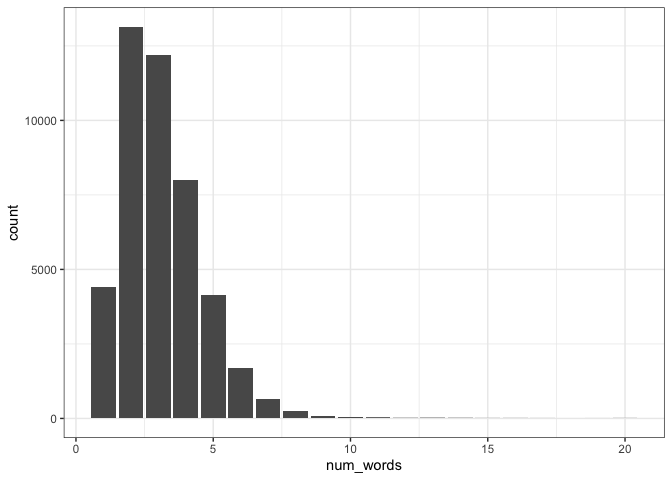

Exploring cleaned data for Melbourne business establishments
================

Looking at business names
-------------------------

Most business names are 5 words or less

``` r
tr %>% 
  mutate(num_words = str_count(name, "\\s") + 1 # counts spaces
         ) %>% 
  ggplot(aes(x = num_words)) + 
  geom_bar(stat = "count") +
  theme_bw()
```



Exploring word tokens and document-feature matrix
-------------------------------------------------

Tokens are typically individual words in the business names (though this default can be changed to capture sentences or n-grams). Let's explore individual words!

Here's a sample of individual words:

``` r
tr_dfm@Dimnames$features %>% head(10)
```

    ##  [1] "com"        "internet"   "cafe"       "corner"     "kiosk"     
    ##  [6] "c"          "mcfarlane"  "acopa"      "australian" "center"

Here's the top features by frequency, some of these look a bit useless such as "pty", "ltd", location names (e.g. "australia") or other descriptions e.g. "centre".

``` r
tr_dfm %>% topfeatures()
```

    ##       pty       ltd australia     group melbourne  services   limited      cafe 
    ##      6195      6041      2137      1487      1447      1136      1105      1103 
    ##    centre        dr 
    ##       838       738

Let's plot the top 40 features by frequency:

``` r
# get top 40 most frequent words
tr_word_features = textstat_frequency(tr_dfm, n = 40)

# Sort by reverse frequency order
tr_word_features$feature <- with(tr_word_features,
                                 reorder(feature
                                         ,-frequency))

# Plot
ggplot(tr_word_features
       , aes(x = feature, y = frequency)) +
    geom_point() +
    theme(axis.text.x = element_text(angle = 90, hjust = 1))
```


Words less than three letters (shown here) don't appear to be overly useful in conveying the meaning of a business (e.g. "inc", "vic", "pty") and single letters are obviously pretty useless.

``` r
# get top n most frequent words less than three characters
tr_word_features_lt3 = tr_dfm %>% 
  dfm_remove(max_nchar = 3) %>%
  textstat_frequency(n = 40)

# Sort by reverse frequency order
tr_word_features_lt3$feature <- with(tr_word_features_lt3,
                                 reorder(feature
                                         ,-frequency))

# Plot
ggplot(tr_word_features_lt3, aes(x = feature, y = frequency)) +
    geom_point() +
    theme(axis.text.x = element_text(angle = 90, hjust = 1))
```


Looking at only three-letter words, many appear to convey meaning, e.g. "car", "law", "bbq" and "inn", so they probably can't be directly filtered out:

``` r
# get top n most frequent words less than three characters
tr_word_features_3 = tr_dfm %>% 
  dfm_remove(min_nchar = 3
             , max_nchar = 3) %>%
  textstat_frequency(n = 40)

# Sort by reverse frequency order
tr_word_features_3$feature <- with(tr_word_features_3,
                                 reorder(feature
                                         ,-frequency))

# Plot
ggplot(tr_word_features_3, aes(x = feature, y = frequency)) +
    geom_point() +
    theme(axis.text.x = element_text(angle = 90, hjust = 1))
```


What about two-letter words? The abbreviation "dr" is the most common, and likley the most useful. All the rest of the two letter words don't appear to convey much meaning:

``` r
# get top n most frequent words less than three characters
tr_word_features_2 = tr_dfm %>% 
  dfm_remove(min_nchar = 2
             , max_nchar = 2) %>%
  textstat_frequency(n = 50)

# Sort by reverse frequency order
tr_word_features_2$feature <- with(tr_word_features_2,
                                 reorder(feature
                                         ,-frequency))

# Plot
ggplot(tr_word_features_2, aes(x = feature, y = frequency)) +
    geom_point() +
    theme(axis.text.x = element_text(angle = 90, hjust = 1))
```


To get a feel for the types of words, here's a wordcloud for terms which appear between 100 - 550 times, and with more than 4 characters (this is to remove "ltd" and terms like that):

``` r
tr_dfm %>% 
  dfm(remove = stopwords('english')) %>% 
  dfm_remove(min_nchar = 4) %>%
  dfm_trim(min_termfreq = 100
           ,max_termfreq = 550
           ) %>% 
  textplot_wordcloud(color = c('darkcyan', 'cyan3', 'dodgerblue', 'dodgerblue3','dodgerblue4'))
```


Basic data checks
-----------------

It's good to see there are no nulls in the data set:

``` r
tr %>% filter_all(all_vars(is.null(.)))
```

    ## # A tibble: 0 x 6
    ## # … with 6 variables: name <chr>, anzsic_desc_lv4 <chr>, anzsic_code_lv4 <chr>,
    ## #   anzsic_code_lv3 <chr>, anzsic_code_lv2 <chr>, anzsic_code_lv1 <chr>
